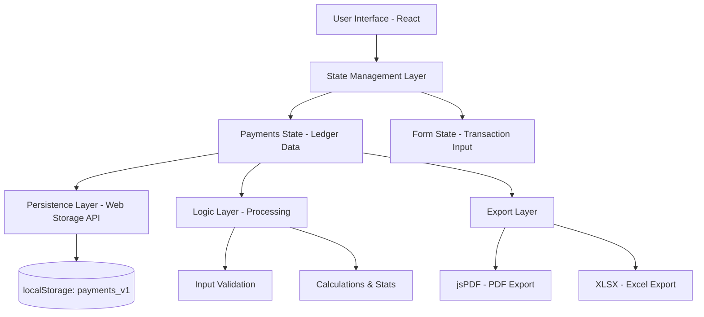

# Simple Payments – Personal Transaction Tracker

## Overview
Simple Payments is a lightweight browser-based payment tracking application built with **React**. The application allows users to record, organize, and analyze personal financial transactions without relying on external servers or databases.

The system functions as a digital ledger where users can log transactions made through various payment methods such as **UPI, card, or cash**. Each entry is categorized, timestamped, and stored locally in the browser.

By using browser storage instead of a remote database, the application provides fast performance, offline accessibility, and full privacy of financial data. Additionally, the application offers export functionality that allows users to generate structured financial records in **PDF and Excel** formats for reporting, analysis, or documentation.

---

## Project Objectives
*   **Quick Recording**: Enable fast logging of daily transactions.
*   **Structured Ledger**: Maintain a clean, organized history of financial activities.
*   **Data Privacy**: Ensure absolute privacy through local storage persistence (no cloud storage).
*   **Financial Insights**: Provide clear summaries and statistics by payment mode.
*   **Professional Export**: High-quality PDF and Excel reports for external documentation.
*   **Modern UI**: Deliver a clean, responsive, and high-contrast accessible interface.

---

## Technology Stack
*   **React**: Core frontend framework for component-based architecture and efficient state management.
*   **Tailwind CSS**: Utility-based styling for a premium dark-theme and responsive layouts.
*   **React Icons**: Visual representation of payment modes and categories (Heroicons).
*   **jsPDF & jspdf-autotable**: Client-side PDF generation with structured transaction tables.
*   **XLSX**: Professional Excel spreadsheet export for advanced data analysis.

---

## Application Architecture
Simple Payments follows a client-side architecture where all logic and data management occur within the browser layers.

### System Architecture Diagram


### State Management Layer
1.  **Payments State**: Stores the complete list of transactions. Each record includes a unique ID, payment method, category, amount (INR), and timestamp.
2.  **Form State**: Manages unsaved user input, validating data before committing to the ledger.

### Persistence Layer
All ledger data is stored under the key `payments_v1` using the **Web Storage API**.
*   **Offline First**: Works completely offline.
*   **Persistent**: Data survives browser refreshes and restarts.
*   **Local Only**: Financial data never leaves the user's device.

---

## Use Case Diagram
```mermaid
usecaseDiagram
    actor User
    User --> (Record Transaction)
    User --> (Select Category)
    User --> (Set Payment Mode)
    User --> (Delete Transaction)
    User --> (Clear All History)
    User --> (Export as PDF)
    User --> (Export as Excel)
    User --> (View Real-time Stats)
    (Record Transaction) ..> (Input Validation) : include
```

---

## Transaction Processing Logic
*   **Input Validation**: Strictly verifies that the amount is a positive number (>0). Rejects invalid numeric formats or negative values.
*   **Transaction Creation**: Generates a record with a unique ID and current timestamp, prepending to the ledger for immediate visibility.
*   **Transaction Deletion**: Provides individual removal with a confirmation safety prompt.
*   **Ledger Reset**: Maintenance control to wipe all history with a secondary confirmation step.

---

## Statistics and Financial Summary
The application calculates real-time insights optimized with memoization:
*   **Total Volume**: Gross amount spent across all transactions.
*   **Payment Method Distribution**: Specific totals for **UPI**, **Card**, and **Cash**.
*   **Transaction Categories**: Contextual labels for Cinema (Movie), Travel (Outing), Fuel (Gas), and Custom Categories for tailored tracking.

---

## User Interface Design (UI/UX)
*   **Design Language**: High-contrast pure black theme for professional focus.
*   **Minimalism**: Prioritizes essential data, removing clutter and emojis.
*   **Hierarchy**: Emphasis on transaction amounts using larger, bold typography.
*   **Responsiveness**: Mobile-first architecture with responsive tables and form grids.

---

## Privacy and Data Security
Simple Payments prioritizes user privacy by design.
*   **0% Transmission**: No data is transmitted to external servers.
*   **User Ownership**: You own your data; it is stored exclusively in your browser's `localStorage`.
*   **No Accounts**: Start tracking instantly without registration or logins.

---

## Performance Optimization
*   **Lightweight Footprint**: Optimized dependency usage.
*   **Memoized Stats**: Prevents re-calculation during UI interactions.
*   **Direct Sync**: Minimal latency between user input and storage persistence.
